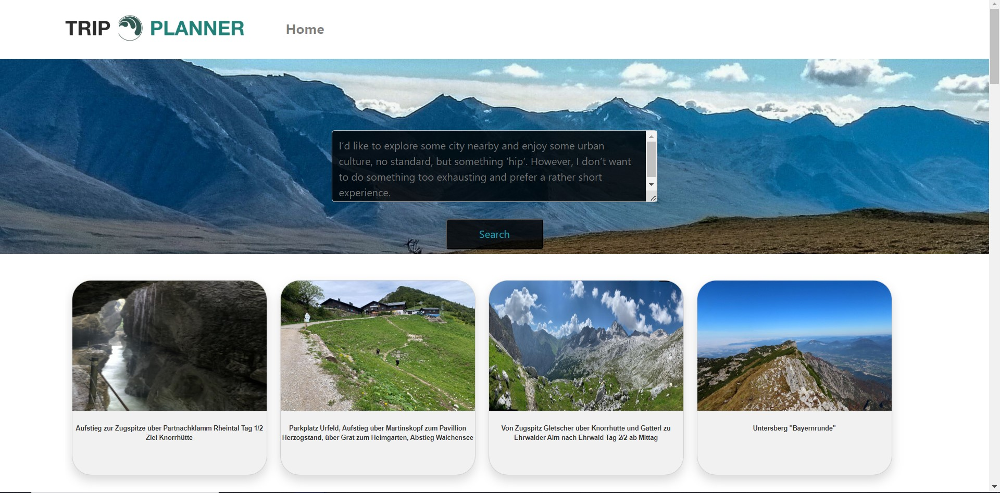
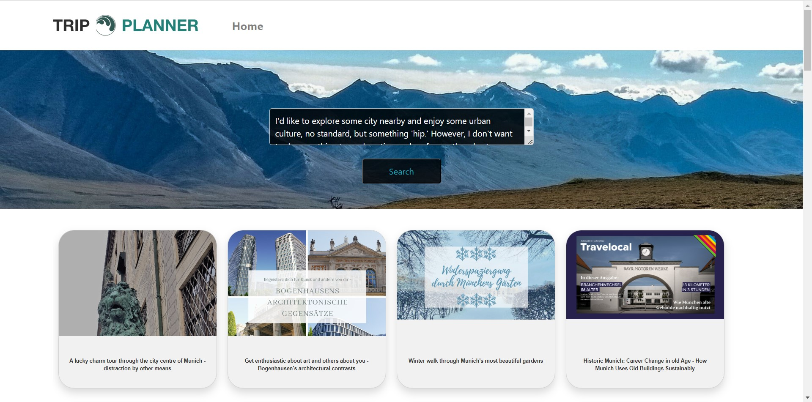
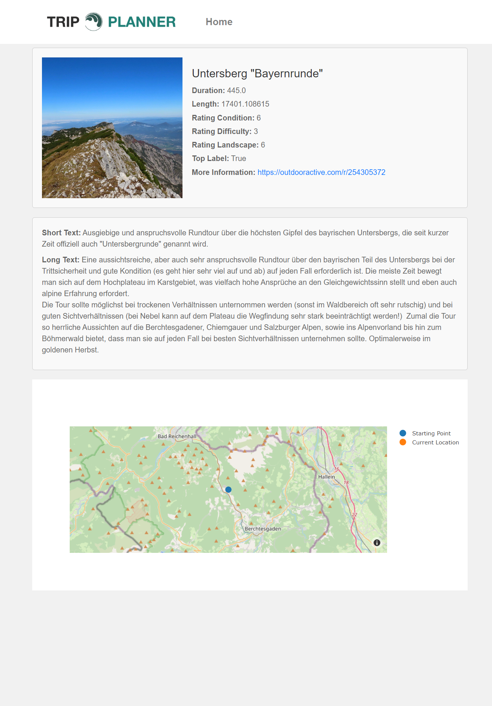

# tour-recommender-frontend
Group 2
## 1. Configure the backend
[tour-recommender-backend](https://github.com/RecSys-SS-2023/tour-recommender-backend)
## 2. Run the command
```
myenv\Scripts\activate
```
```
python manage.py runserver 0.0.0.0:8000
```
## 3. Open the web in your browser
```
http://127.0.0.1:8000/tourapp/
```
### homepage

### sample request

### tour detail
